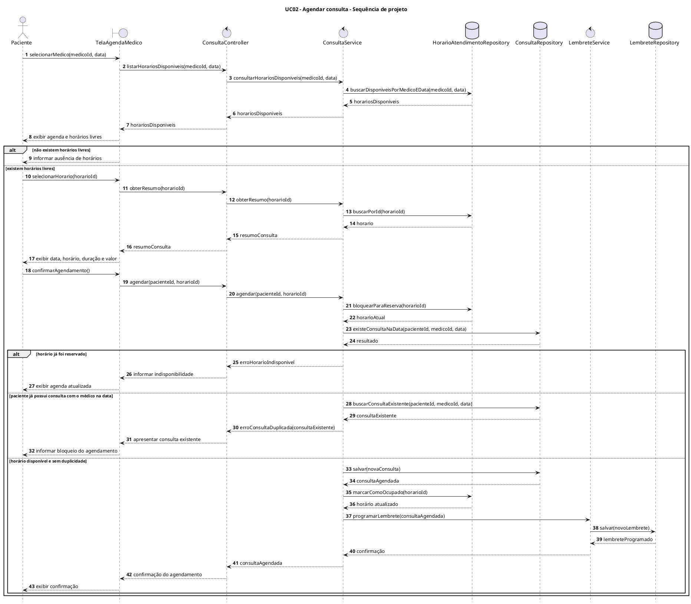
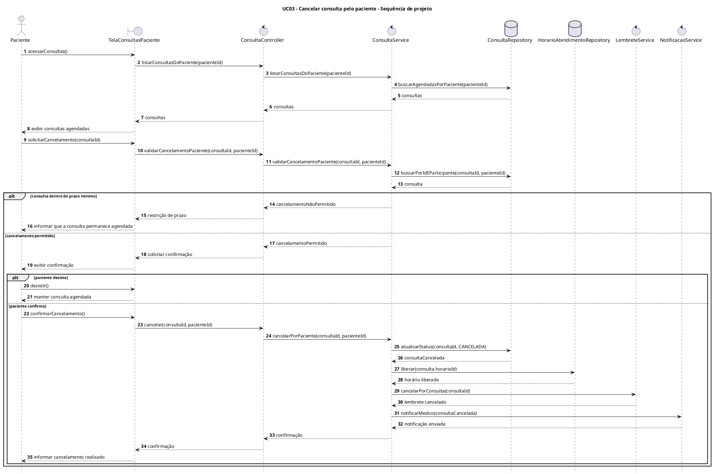
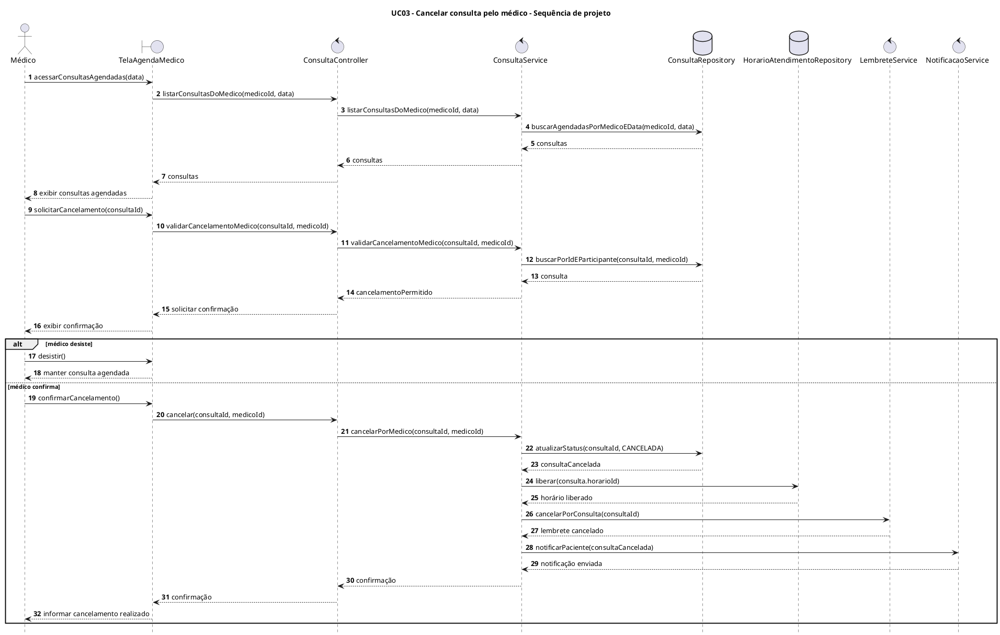
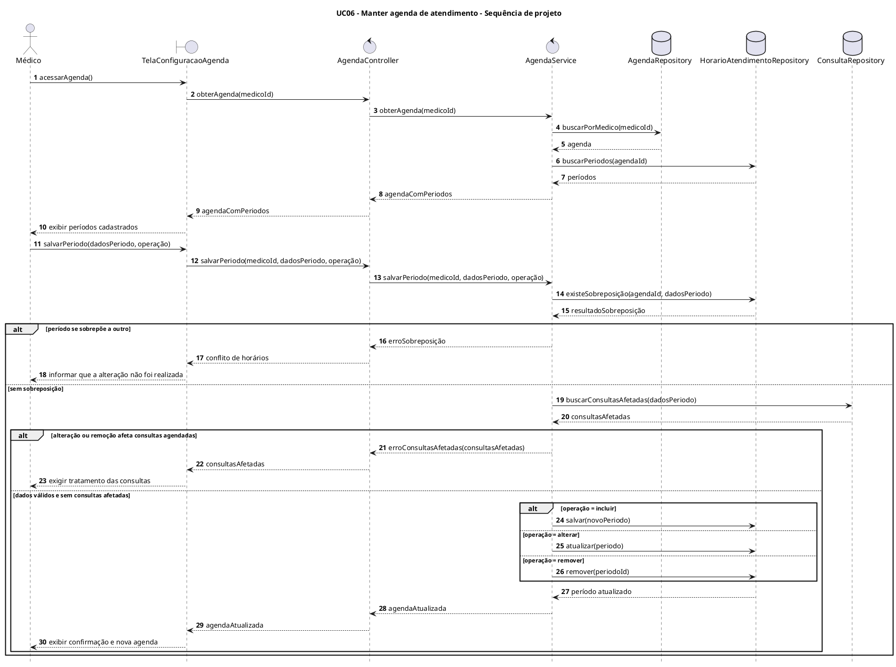
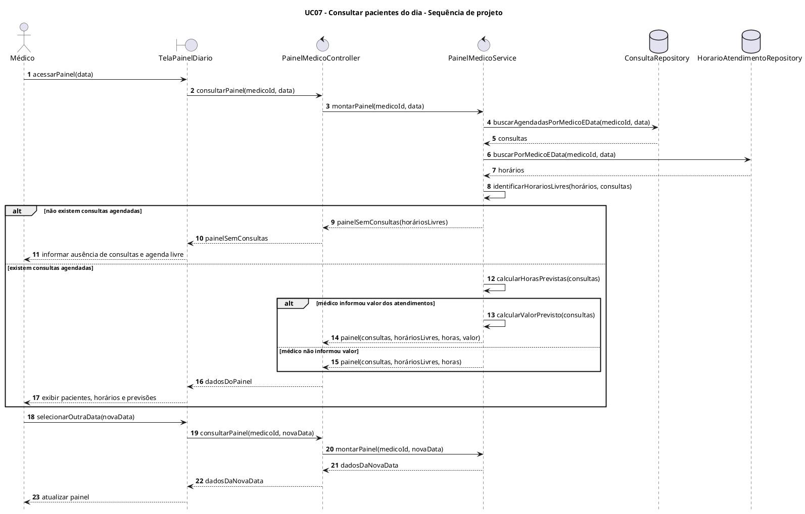

# Diagramas de Sequência de Projeto

## Sistema de Agendamento de Consultas

### Grupo 24

Este documento apresenta um rascunho dos diagramas de sequência de projeto dos casos de uso principais do Sistema de Agendamento de Consultas.

> **Premissa deste rascunho:** como o repositório ainda não contém implementação nem diagramas de classes de projeto, os diagramas adotam uma arquitetura web genérica em camadas. Os nomes das classes e operações deverão ser conferidos quando o diagrama de classes de projeto for concluído.

## 1. Organização adotada

Os participantes dos diagramas foram organizados segundo suas responsabilidades:

- **Tela (`boundary`)**: recebe as ações do usuário e apresenta os resultados.
- **Controller (`control`)**: recebe as requisições da interface.
- **Service (`control`)**: executa as regras de negócio do caso de uso.
- **Repository (`repository`)**: consulta e persiste os dados.
- **Serviço auxiliar (`service`)**: executa lembretes e notificações.

Os diagramas cobrem os casos de uso UC02, UC03, UC06 e UC07 detalhados na primeira versão da documentação.

---

## 2. UC02 - Agendar consulta

O diagrama mostra a consulta aos horários disponíveis e a confirmação do agendamento. Também representa as regras que impedem a reserva simultânea do mesmo horário e o agendamento duplicado para o mesmo médico na mesma data.

---

## 3. UC03 - Cancelar consulta pelo paciente

O cancelamento solicitado pelo paciente verifica o prazo mínimo. Quando permitido, a consulta é cancelada, o horário é liberado, o lembrete é cancelado e o médico é notificado.

---

## 4. UC03 - Cancelar consulta pelo médico

O médico não está sujeito ao prazo mínimo definido para o paciente. Após a confirmação, o sistema realiza as mesmas atualizações e notifica o paciente.

---

## 5. UC06 - Manter agenda de atendimento

O diagrama representa a inclusão, a alteração e a remoção de períodos da agenda do médico. Antes de persistir uma mudança, o serviço verifica sobreposição e consultas já agendadas.

---

## 6. UC07 - Consultar pacientes do dia

O diagrama mostra a montagem do painel diário do médico, incluindo pacientes agendados, horários livres, previsão de horas de atendimento e valor previsto a receber.

---

## 7. Pendências para a versão final

Antes de inserir os diagramas no documento consolidado, será necessário:

1. conferir os nomes das classes e dos métodos no diagrama de classes de projeto;
2. substituir os nomes genéricos caso o grupo adote convenções específicas de algum framework;
3. confirmar se lembretes e notificações serão serviços internos ou integrações externas;
4. renderizar os diagramas em alta resolução;
5. numerar as figuras e incluir suas referências no texto e na lista de figuras.

