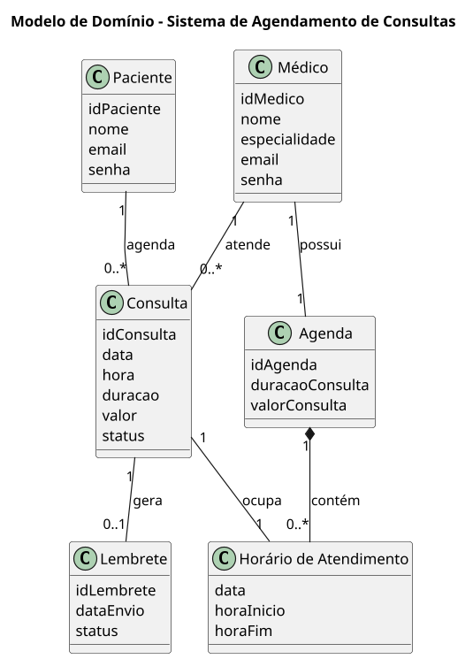
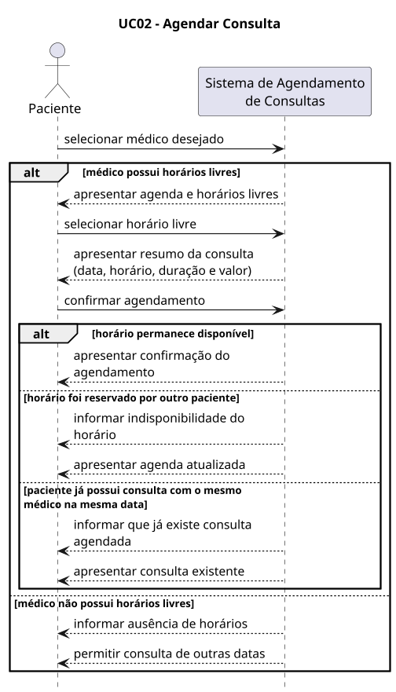
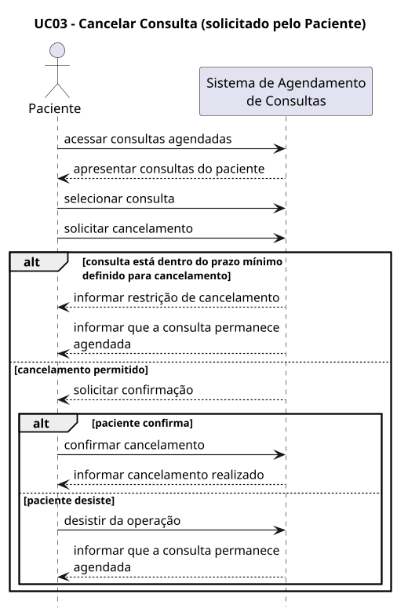
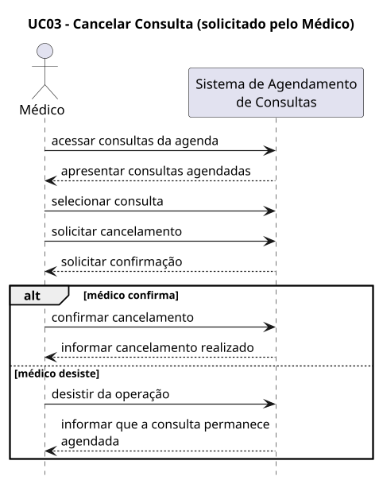
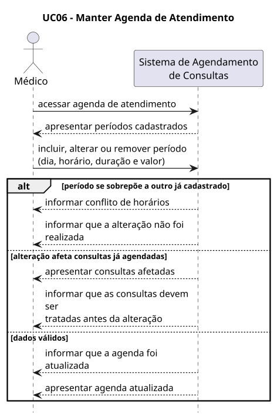
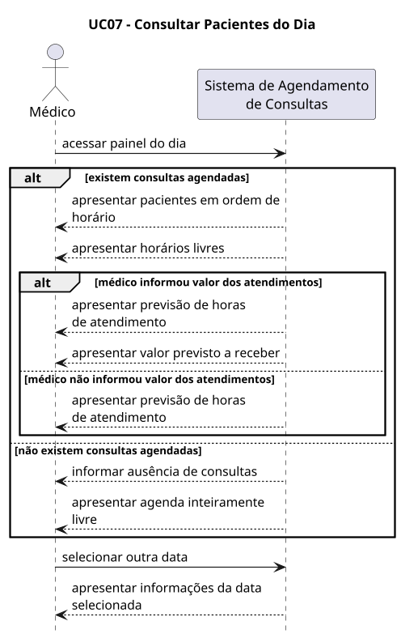

---
puppeteer:
  format: "A4"
  printBackground: true
  margin:
    top: "20mm"
    bottom: "20mm"
    left: "25mm"
    right: "25mm"
---

# A2 - Praticando

## Sistema de Agendamento de Consultas

### Grupo 24

- Caio Henrique Gomes Paulo
- David Pessoa
- Fabio Capalbo Payao Rodrigues
- Jean Carlos Monteiro Santos
- Jessica Isis Medeiros Oliveira

---

## 1. Modelo de Domínio

O modelo de domínio apresenta os principais conceitos envolvidos no Sistema de Agendamento de Consultas e os relacionamentos existentes entre eles.

---

## 2. Diagramas de Sequência de Sistema

Os diagramas de sequência de sistema representam as interações entre os atores e o Sistema de Agendamento de Consultas durante a execução dos principais casos de uso definidos na fase de concepção.

### 2.1 UC02 - Agendar consulta

### 2.2 UC03 - Cancelar consulta

O caso de uso UC03 é representado em dois diagramas, correspondentes aos dois atores que podem originar o cancelamento.

#### 2.2.1 Cancelamento solicitado pelo paciente

#### 2.2.2 Cancelamento solicitado pelo médico

### 2.3 UC06 - Manter agenda de atendimento

### 2.4 UC07 - Consultar pacientes do dia

