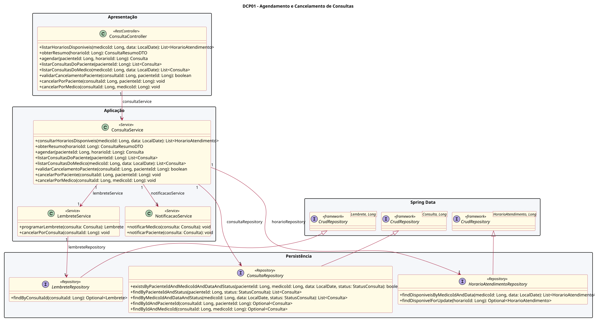
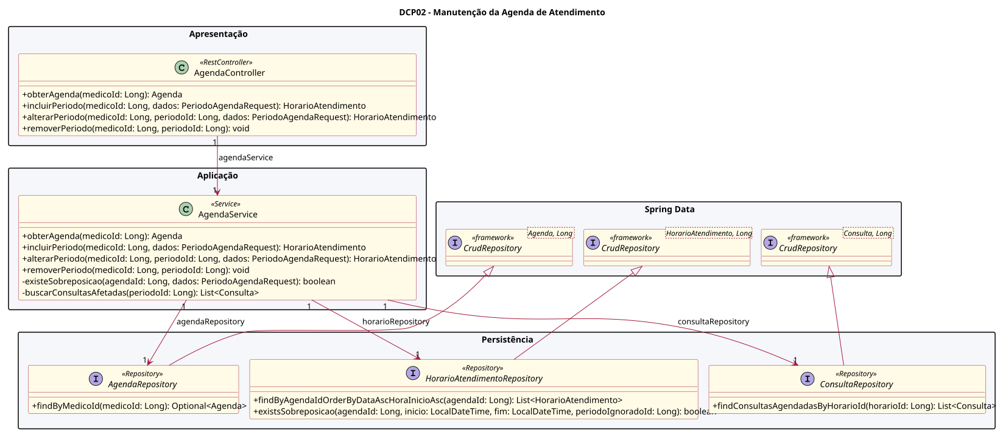
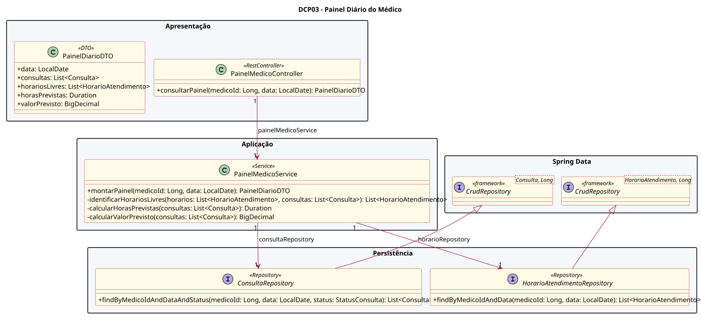

# Diagramas de Classes de Projeto

## Sistema de Agendamento de Consultas - Grupo 24

Esta seção apresenta as classes de software definidas para a arquitetura do Sistema de Agendamento de Consultas. O projeto considera uma aplicação web implementada com Java e Spring Boot e adota a separação em camadas `Controller`, `Service` e `Repository`.

Os diagramas foram divididos por responsabilidade para preservar a legibilidade. As interfaces de persistência especializam `CrudRepository`, componente fornecido pelo Spring Data, enquanto os serviços concentram as regras de negócio descritas nos casos de uso principais.

## 1. Convenções adotadas

- `<<RestController>>`: recebe as requisições da aplicação web.
- `<<Service>>`: executa regras de negócio e coordena as operações.
- `<<Repository>>`: realiza consultas e persistência dos dados.
- `<<framework>>`: interface fornecida pelo Spring Data.
- `<<DTO>>`: objeto utilizado para transportar dados entre as camadas.
- `+`: operação pública.
- `-`: operação privada.

## 2. DCP01 - Agendamento e cancelamento de consultas

Este diagrama suporta o UC02 - Agendar consulta e o UC03 - Cancelar consulta. A classe `ConsultaService` verifica a disponibilidade do horário, impede duplicidade de consulta, aplica a regra de prazo de cancelamento e coordena lembretes e notificações.

Fonte: elaborada pelos autores.

## 3. DCP02 - Manutenção da agenda de atendimento

Este diagrama suporta o UC06 - Manter agenda de atendimento. A classe `AgendaService` consulta e altera períodos da agenda, rejeita sobreposições e impede mudanças que afetem consultas já agendadas.

Fonte: elaborada pelos autores.

## 4. DCP03 - Painel diário do médico

Este diagrama suporta o UC07 - Consultar pacientes do dia. A classe `PainelMedicoService` combina consultas e horários da agenda e produz a previsão de horas de atendimento e de valor a receber.

Fonte: elaborada pelos autores.

## 5. Rastreabilidade

| Caso de uso | Controller | Service | Repositories principais |
|---|---|---|---|
| UC02 - Agendar consulta | `ConsultaController` | `ConsultaService` | `ConsultaRepository`, `HorarioAtendimentoRepository`, `LembreteRepository` |
| UC03 - Cancelar consulta | `ConsultaController` | `ConsultaService` | `ConsultaRepository`, `HorarioAtendimentoRepository`, `LembreteRepository` |
| UC06 - Manter agenda | `AgendaController` | `AgendaService` | `AgendaRepository`, `HorarioAtendimentoRepository`, `ConsultaRepository` |
| UC07 - Consultar pacientes do dia | `PainelMedicoController` | `PainelMedicoService` | `ConsultaRepository`, `HorarioAtendimentoRepository` |

## 6. Premissas de projeto

1. A solução será uma aplicação web desenvolvida com Java e Spring Boot.
2. O Spring Data será utilizado para persistência, com repositories que especializam `CrudRepository`.
3. Os nomes e as operações representam o projeto da solução; poderão ser refinados durante a implementação sem alterar as responsabilidades apresentadas.
4. As classes de domínio `Paciente`, `Medico`, `Agenda`, `HorarioAtendimento`, `Consulta` e `Lembrete` permanecem detalhadas no modelo de domínio e aparecem aqui como tipos utilizados pelas classes de projeto.
